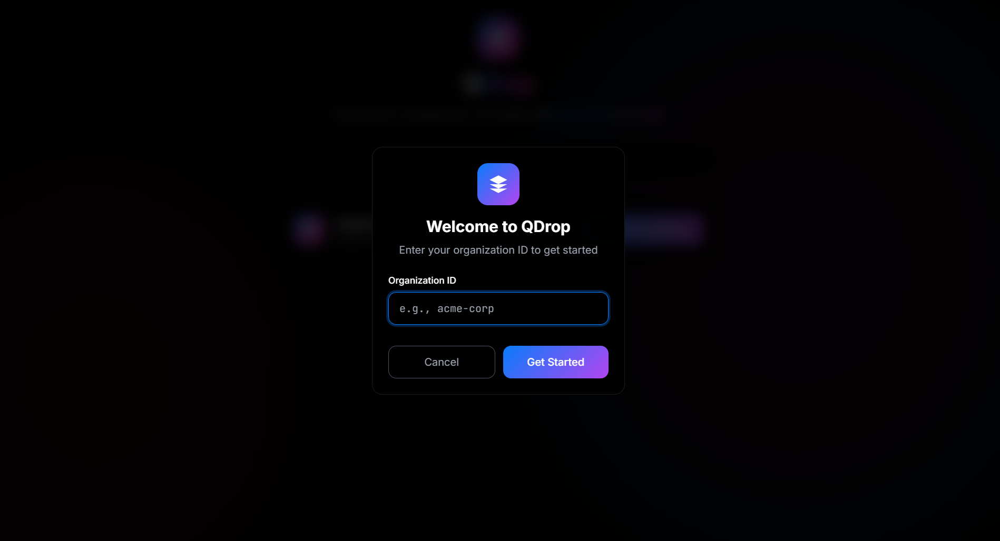
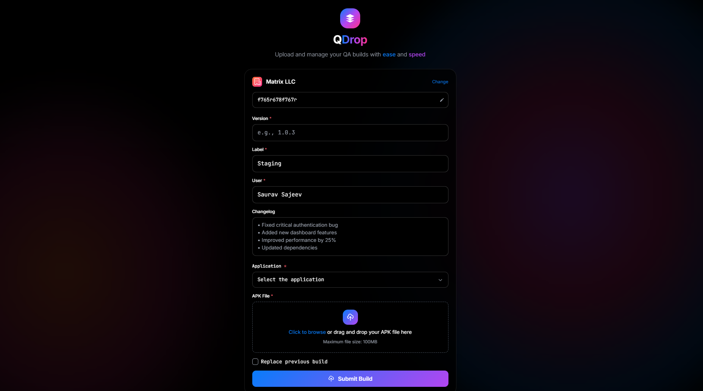
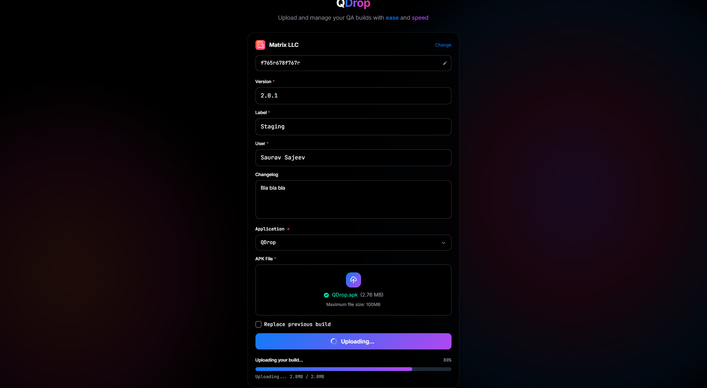

# QDrop Web App

QDrop is an open-source web application designed to help developers upload and manage their QA builds efficiently. It offers a simple and intuitive interface for uploading APK files along with associated metadata such as version, label, and changelog. Uploaded APK files are hosted securely on Supabase Storage, while metadata is stored in Firebase Realtime Database.

---

## Mobile App

A Jetpack Compose based Android app that works alongside this web app for managing QA builds is also open source. You can find it here:

[https://github.com/styropyr0/QDrop-App](https://github.com/styropyr0/QDrop-App)

---

## Screenshots

  
*Enter the unique organization ID to upload builds*

  
*Enter version, label, and changelog and upload the build*

  
*View upload progress and status*


## Features

* Upload APK files (up to 100MB) via drag & drop or browse
* Add version, label, and detailed changelog for each build
* Specify organization ID to organize uploads
* Stores APK files on Supabase Storage
* Saves metadata in Firebase Realtime Database
* Open-source and easy to customize

---

## Project Structure

```
public/
  ├── css/
  │    └── styles.css         # CSS styles for the app
  ├── js/
  │    ├── app.js             # Main app logic
  │    ├── config.js          # Configuration template (API keys, URLs, etc.)
  │    ├── organization-manager.js
  │    └── upload-manager.js
  ├── index.html              # Main HTML file
.gitignore
LICENSE
package.json                 # Project dependencies
README.md
server.js                   # Backend server for hosting/api (if any)
```

---

## Configuration

**Important:** Developers must update `public/js/config.js` with their own Supabase and Firebase credentials **before running the app**. This includes Supabase URL and anon key, Firebase API keys, database URLs, storage bucket names, and other relevant parameters.

```js
const CONFIG = {
    SUPABASE_URL: 'https://YOUR_PROJECT_ID.supabase.co',
    SUPABASE_ANON_KEY: 'YOUR_SUPABASE_ANON_KEY',

    FIREBASE_CONFIG: {
        apiKey: "YOUR_FIREBASE_API_KEY",
        authDomain: "YOUR_PROJECT_ID.firebaseapp.com",
        databaseURL: "https://YOUR_PROJECT_ID-default-rtdb.REGION.firebasedatabase.app",
        projectId: "YOUR_PROJECT_ID",
        storageBucket: "YOUR_PROJECT_ID.appspot.com",
        messagingSenderId: "YOUR_SENDER_ID",
        appId: "YOUR_APP_ID",
        measurementId: "YOUR_MEASUREMENT_ID"
    },

    STORAGE_BUCKET: 'YOUR_SUPABASE_BUCKET_NAME',

    MAX_FILE_SIZE: 100 * 1024 * 1024, // 100MB max upload

    ALLOWED_FILE_TYPES: ['.apk'],

    GITHUB: {
        USERNAME: 'YOUR_GITHUB_USERNAME',
        REPOSITORY: 'YOUR_GITHUB_REPOSITORY'
    }
};
```

---

## How to Run

### Prerequisites

* [Node.js](https://nodejs.org/) installed
* Firebase project with Realtime Database enabled
* Supabase project with Storage bucket created and configured

### Steps

1. Fork the repository on GitHub.

2. Clone your fork locally:

```bash
git clone https://github.com/YOUR_GITHUB_USERNAME/QDrop-Web.git
cd qdrop-web
```

3. Install dependencies:

   ```bash
   npm install
   ```

4. Update your credentials in `public/js/config.js`.

5. Start the backend server:

   ```bash
   node server.js
   ```

6. Open your browser at `http://localhost:3000`.

---

## Security Recommendations

* Use environment variables or secrets management for production keys.
* Secure Firebase Realtime Database rules.
* Set proper Supabase Storage bucket permissions.
* Avoid committing private keys to public repositories.

---

## Contributing

Contributions and improvements are welcome! Please fork the repo and submit pull requests. Make sure to keep API keys and secrets out of your commits.

---

## License

MIT License — see the LICENSE file for details.

