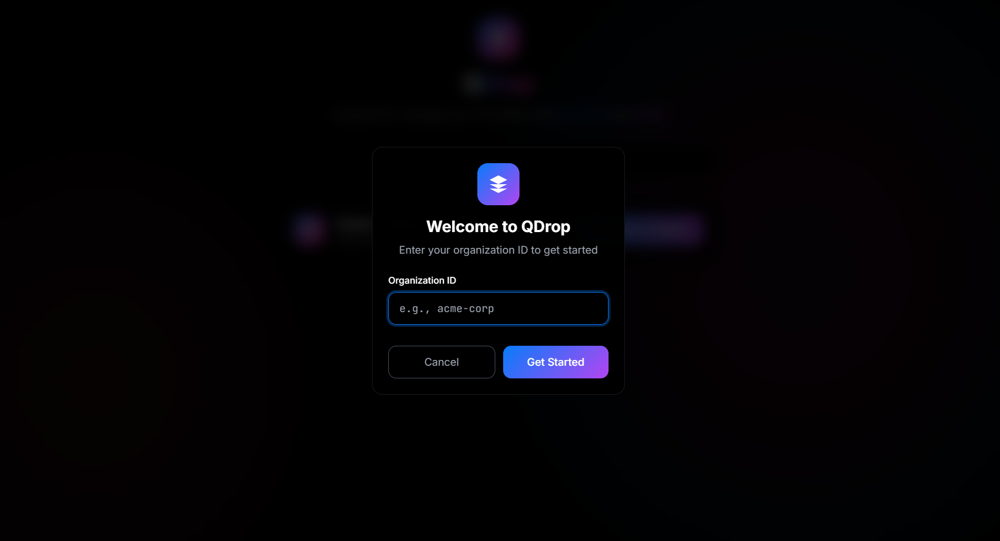
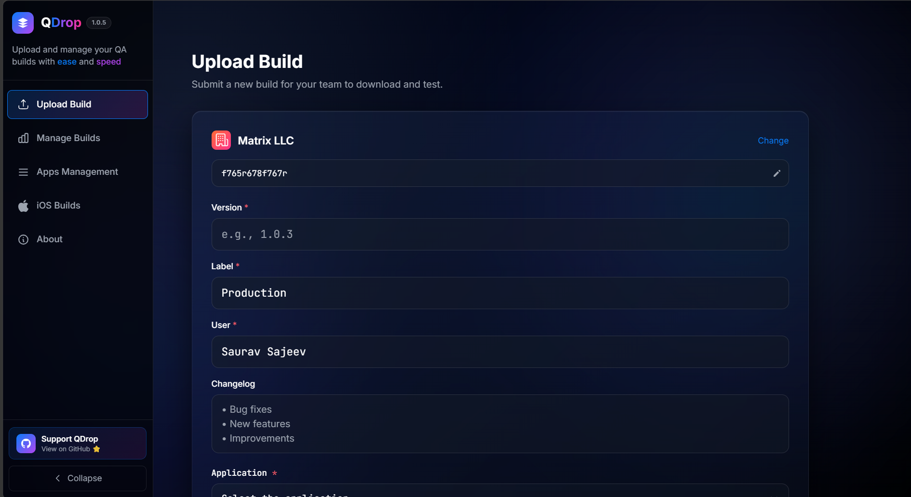
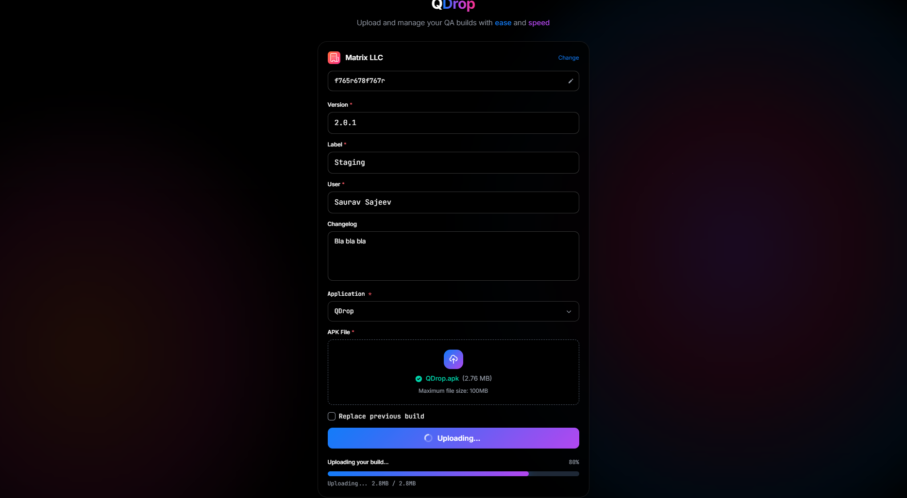
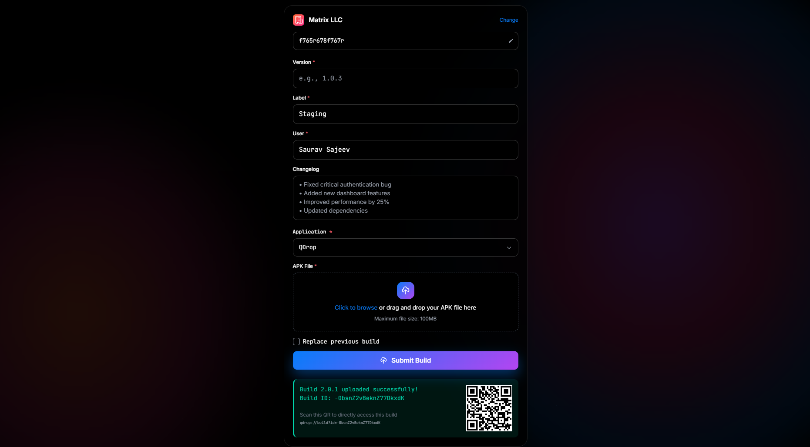

# QDrop Web App

QDrop is an open-source web application designed to help developers upload and manage their QA builds efficiently.
It provides a clean, intuitive interface to upload APK files along with metadata such as version, label, and changelog.
Uploaded APKs are securely hosted on **Cloudflare R2**, and their metadata is stored in **Firebase Realtime Database**.

---

## Mobile App

A Jetpack Compose-based Android app that works alongside this web app for managing QA builds is also open source:
[Mobile App](https://github.com/styropyr0/QDrop-App)

---

## Screenshots


*Enter the unique organization ID to upload builds*


*Provide version, label, changelog, and upload the build*


*View real-time upload progress and status*


*See confirmation, Build ID, and QR code for direct access*

---

## Features

* Upload APK files (up to 100 MB) via drag & drop or file browser
* Display of upload progress and live status
* Generate Build ID and QR code for direct download
* Add version, label, and detailed changelog for each build
* Option to replace a previous build
* Organize uploads using unique organization IDs
* Store APKs on **Cloudflare R2**
* Save metadata in **Firebase Realtime Database**
* Sleek dark theme with gradient design and responsive layout
* Input validation and improved error/success notifications
* Open-source and easy to customize

---

## Project Structure

```
public/
  ├── css/
  │    └── styles.css              # App styles
  ├── js/
  │    ├── app.js                  # Main app logic
  │    ├── config.js               # Configuration (API keys, endpoints, etc.)
  │    ├── organization-manager.js # Handles organization switching
  │    └── upload-manager.js       # Handles upload and progress logic
  ├── index.html                   # Main web interface
.gitignore
LICENSE
package.json                       # Project dependencies
README.md
server.js                          # Optional local hosting server
```

---

## Configuration

Before running QDrop, edit `public/js/config.js` with your **Cloudflare R2** and **Firebase** credentials.
These credentials are required for upload and metadata storage.

```js
const CONFIG = {
    SUPABASE_URL: 'https://YOUR_PROJECT_ID.supabase.co',
    SUPABASE_ANON_KEY: 'YOUR_SUPABASE_ANON_KEY',

    FIREBASE_CONFIG: {
        apiKey: "YOUR_FIREBASE_API_KEY",
        authDomain: "YOUR_PROJECT_ID.firebaseapp.com",
        databaseURL: "https://YOUR_PROJECT_ID-default-rtdb.REGION.firebasedatabase.app",
        projectId: "YOUR_PROJECT_ID",
        storageBucket: "YOUR_PROJECT_ID.appspot.com",
        messagingSenderId: "YOUR_SENDER_ID",
        appId: "YOUR_APP_ID",
        measurementId: "YOUR_MEASUREMENT_ID"
    },

    STORAGE_BUCKET: 'YOUR_SUPABASE_BUCKET_NAME',

    MAX_FILE_SIZE: 100 * 1024 * 1024, // 100MB max upload

    ALLOWED_FILE_TYPES: ['.apk'],

    GITHUB: {
        USERNAME: 'YOUR_GITHUB_USERNAME',
        REPOSITORY: 'YOUR_GITHUB_REPOSITORY'
    }
};
```

---

## How to Run

### Prerequisites

* [Node.js](https://nodejs.org/) installed
* Firebase project with Realtime Database enabled
* Cloudflare R2 bucket created and configured for S3-compatible access

### Steps

1. **Fork** the repository on GitHub
2. **Clone** it locally:

   ```bash
   git clone https://github.com/YOUR_GITHUB_USERNAME/QDrop-Web.git
   cd qdrop-web
   ```
3. **Install dependencies:**

   ```bash
   npm install
   ```
4. **Update credentials** in `public/js/config.js`
5. **Start the server (optional for local testing):**

   ```bash
   node server.js
   ```
6. **Open your browser:**
   [http://localhost:3000](http://localhost:3000)

---

## Security Recommendations

* Never expose Cloudflare R2 or Firebase keys publicly
* Use environment variables or secret-management tools for production
* Configure secure Firebase Realtime Database rules
* Set R2 bucket permissions to allow only required operations (e.g., `PutObject`, `GetObject`)
* Avoid committing any sensitive credentials to GitHub

---

## Contributing

Contributions are welcome!
Fork the repository, make improvements, and submit a pull request.
Please keep all private keys and secrets out of your commits.

---

## License

MIT License — see the [LICENSE](LICENSE) file for details.

