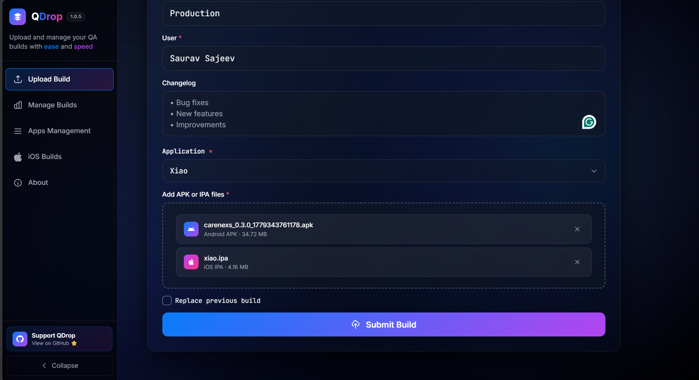
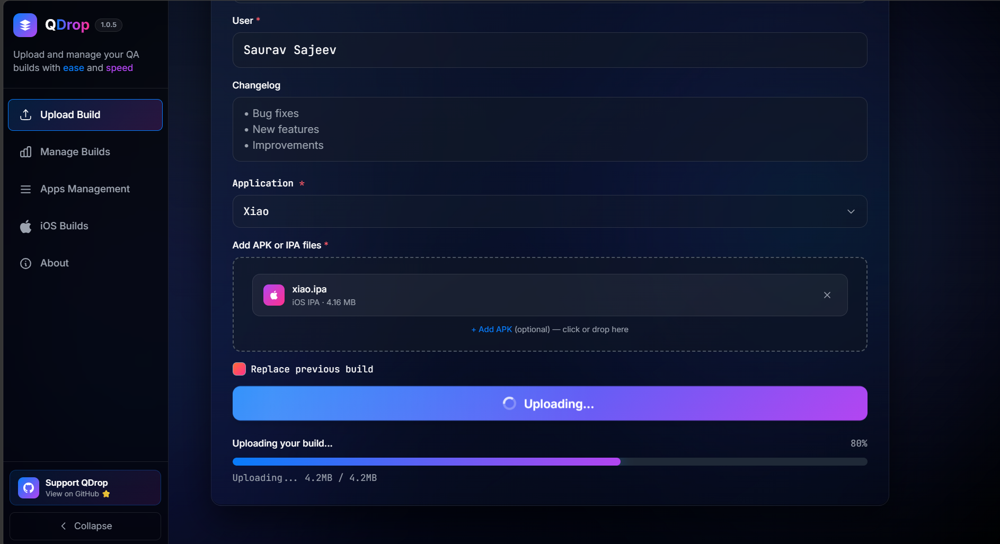
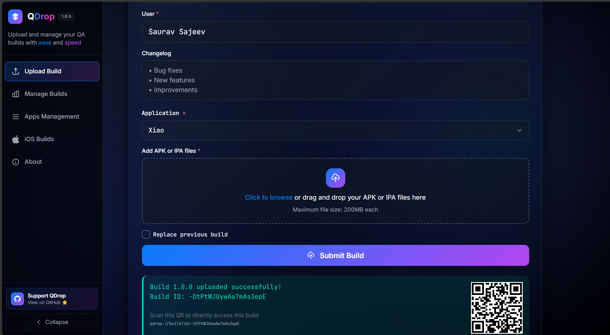
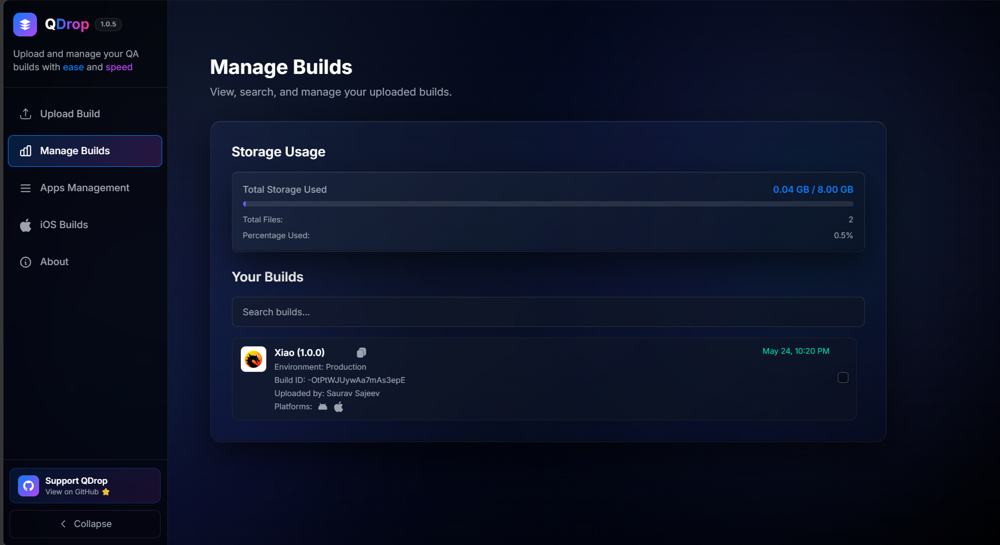
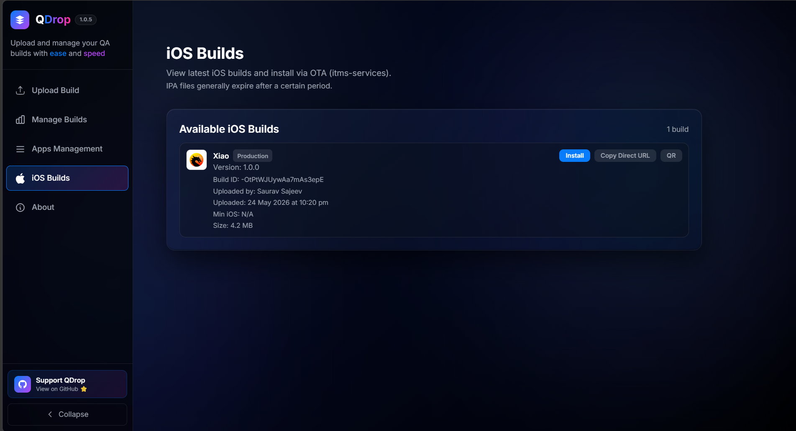
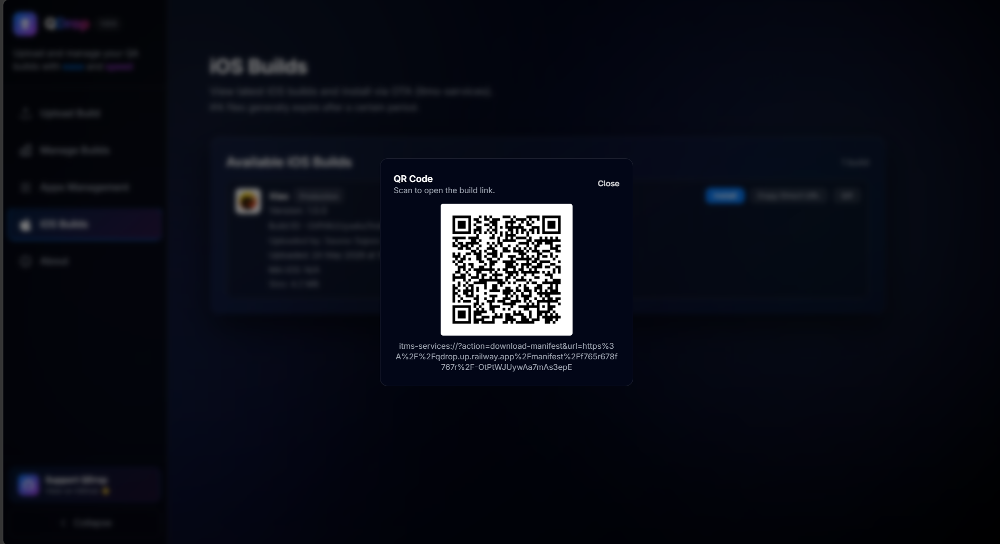
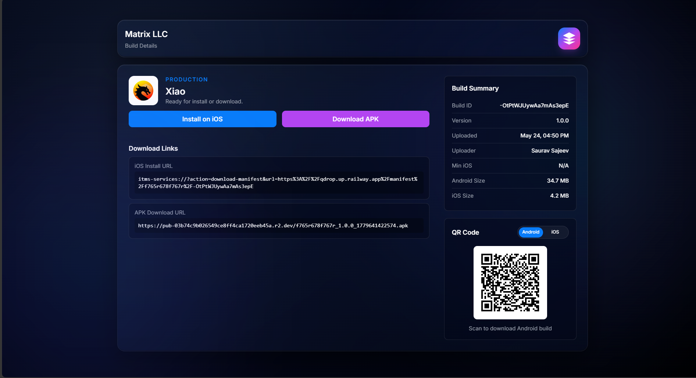

# QDrop Web

QDrop is an open-source web app for managing QA builds and distributing Android/iOS artifacts to your team.
The current implementation serves a browser UI, generates presigned Cloudflare R2 upload URLs, and exposes lightweight server routes for download metadata and install pages.

## Mobile App

A companion mobile app is also open source:
[QDrop App](https://github.com/styropyr0/QDrop-App)

## What it does

- Upload APK files through the web UI with progress feedback
- Organize uploads by organization ID
- Store build metadata in Firebase Realtime Database
- Store binaries in Cloudflare R2
- Generate presigned upload URLs for secure direct uploads
- Render a public downloads page and install-related pages from backend metadata
- Support local development with a small Express server

## Screenshots


*Upload a build from the main dashboard*


*Add version, label, changelog, and other upload details*


*Track upload progress while files are being sent*


*Confirm a successful upload and review the build details*


*Browse and manage stored builds in the app*


*Preview iOS build artifacts and related metadata*


*Share an installable iOS URL using the generated QR code*


*Copy a public shareable link for the build*

## Project structure

```
.
├── public/
│   ├── css/styles.css
│   ├── js/
│   │   ├── app.js
│   │   ├── builds-manager.js
│   │   ├── config.js
│   │   ├── ios-installer.js
│   │   ├── organization-manager.js
│   │   ├── side-panel.js
│   │   ├── sidebar-navigation.js
│   │   ├── storage-analytics.js
│   │   └── upload-manager.js
│   └── index.html
├── screenshots/
├── .env
├── .gitignore
├── LICENSE
├── package.json
├── README.md
├── server.js
├── serviceAccountKey.json
```

## Current stack

- **Frontend:** static HTML/CSS/JS under `public/`
- **Backend:** Node.js + Express
- **Storage:** Cloudflare R2 for build binaries
- **Database:** Firebase Realtime Database / Firebase Admin SDK
- **Auth/SDKs:** AWS S3 client for presigned upload URLs, Firebase Admin

## Configuration

### 1. Frontend config

Update `public/js/config.js` with your Firebase values and bucket naming defaults.
This file is still used as a template and as a shared config export for the server.

```js
const CONFIG = {
  FIREBASE_CONFIG: {
    apiKey: 'YOUR_FIREBASE_API_KEY',
    authDomain: 'YOUR_PROJECT_ID.firebaseapp.com',
    databaseURL: 'https://YOUR_PROJECT_ID-default-rtdb.REGION.firebasedatabase.app',
    projectId: 'YOUR_PROJECT_ID',
    storageBucket: 'YOUR_PROJECT_ID.appspot.com',
    messagingSenderId: 'YOUR_SENDER_ID',
    appId: 'YOUR_APP_ID',
    measurementId: 'YOUR_MEASUREMENT_ID'
  },
  STORAGE_BUCKET: 'YOUR_CLOUDFLARE_R2_BUCKET_NAME',
  MAX_FILE_SIZE: 100 * 1024 * 1024,
  ALLOWED_FILE_TYPES: ['.apk'],
  GITHUB: {
    USERNAME: 'YOUR_GITHUB_USERNAME',
    REPOSITORY: 'YOUR_GITHUB_REPOSITORY'
  }
};
```

### 2. Environment variables

The server reads its runtime secrets from `.env` and uses them for Cloudflare R2 and the local server port.

```env
CLOUDFLARE_ACCOUNT_ID=<your cloudflare account id>
R2_ACCESS_KEY_ID=<your r2 access key id>
R2_SECRET_ACCESS_KEY=<your r2 secret access key>
R2_BUCKET_NAME=<your r2 bucket name>
PUBLIC_DEV_URL=<your_dev_url>
PORT=3000
```

### 3. Firebase Admin credentials

`server.js` initializes Firebase Admin with `serviceAccountKey.json`.
Keep that file private and do **not** commit real credentials to a public repository.

## Run locally

### Prerequisites

- [Node.js](https://nodejs.org/)
- A Firebase project with Realtime Database enabled
- A Cloudflare R2 bucket configured for S3-compatible access

### Install and start

```bash
npm install
npm run dev
```

The app serves on `http://localhost:3000` by default (or the port from `.env`).

### Available scripts

```json
"scripts": {
  "dev": "node server.js",
  "start": "node server.js"
}
```

## Notes on current behavior

- The server exposes `/api/upload-url` for presigned upload URLs.
- The server also exposes `/api/storage-info` for storage usage information.
- The `/downloads` route renders metadata from Firebase under `app_update`.
- The frontend expects a valid Firebase runtime and your Cloudflare R2 configuration to be present.

## Security recommendations

- Do not commit real Firebase Admin credentials or R2 keys.
- Use `.env` locally and a secrets manager in production.
- Keep Firebase Realtime Database rules locked down.
- Restrict R2 permissions to the operations your app actually needs.

## Contributing

Contributions are welcome. Fork the repo, make the improvement, and open a pull request.
Please keep secrets out of the commit history.

## License

MIT License — see the [LICENSE](LICENSE) file for details.

