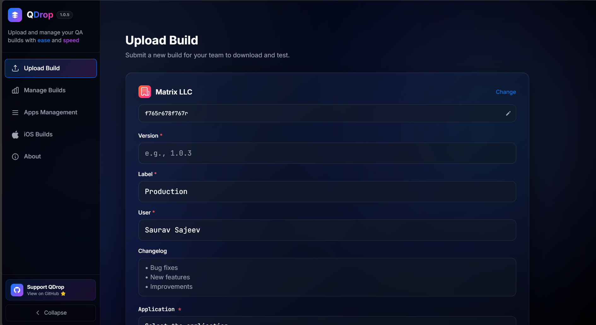
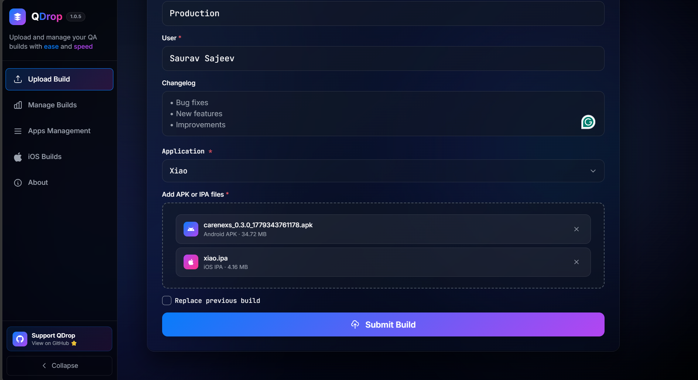
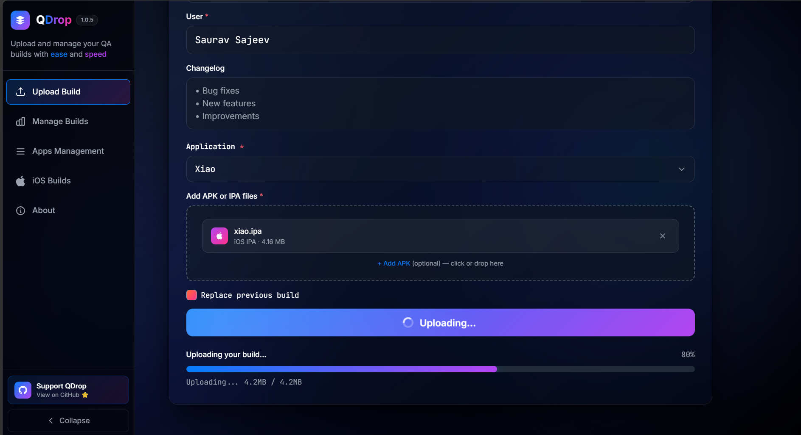
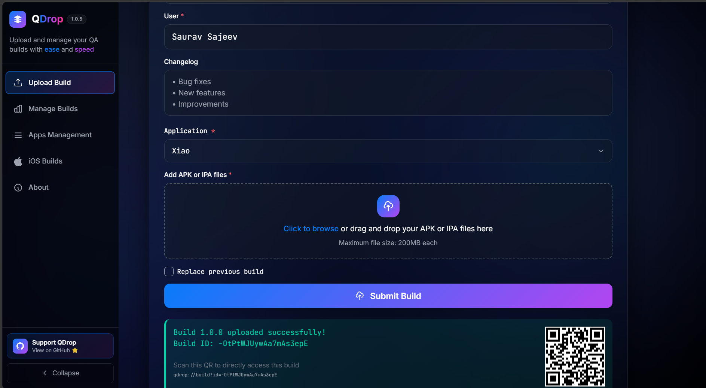
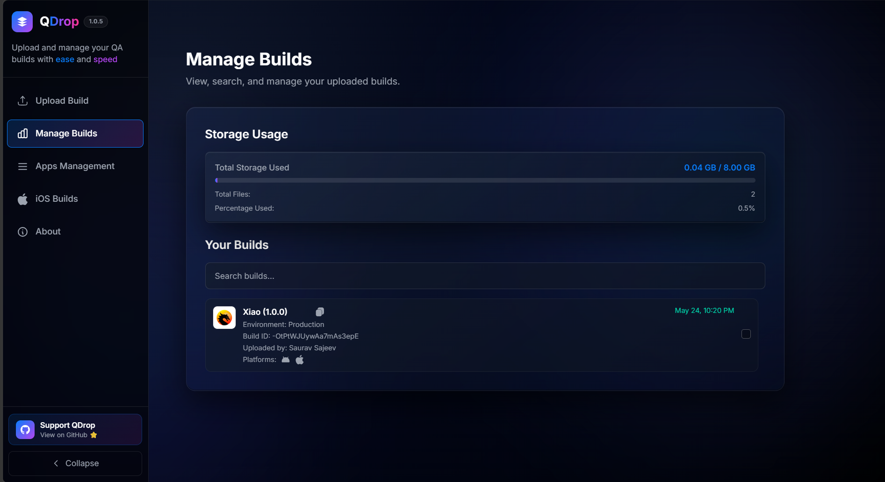
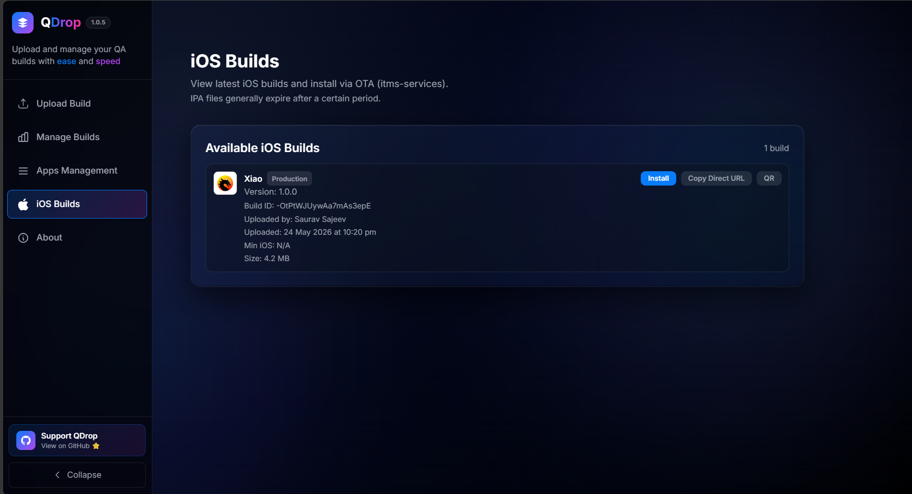
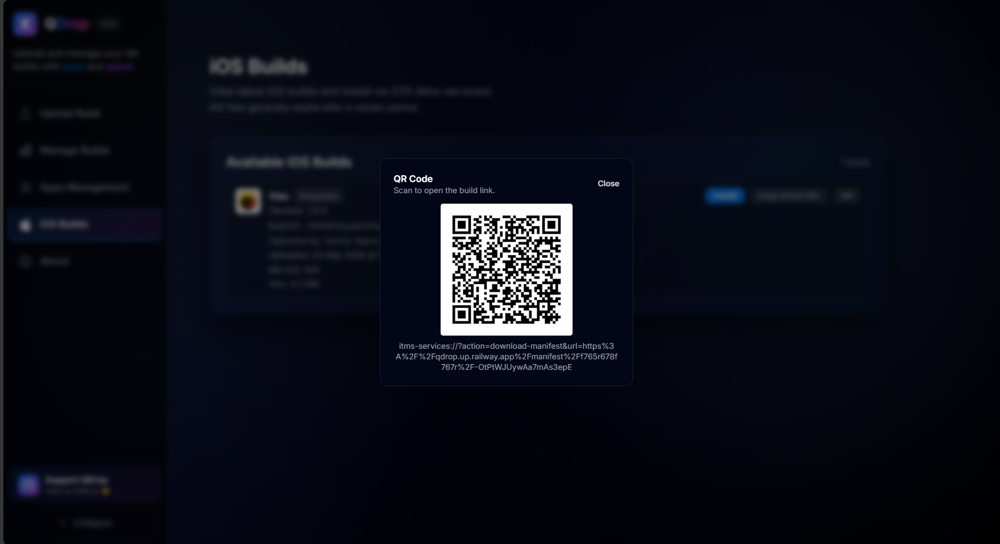
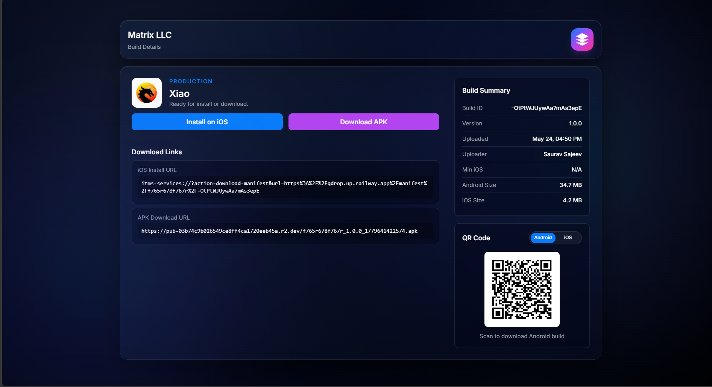

# QDrop Web

QDrop is an open-source web app for managing QA builds and distributing Android/iOS artifacts to your team.

The web UI talks to an Express backend that stores build metadata in Firebase Realtime Database, uploads binaries to Cloudflare R2 or AWS S3 via presigned URLs, and serves install/download pages for sharing.

**Current version:** 1.0.6 — see [CHANGELOG.md](https://github.com/styropyr0/QDrop-Web/releases/tag/v1.0.6)

## Mobile App

A companion mobile app is also open source:  
[QDrop App](https://github.com/styropyr0/QDrop-App)

## What it does

- Upload APK and IPA builds through the web UI with progress feedback
- Organize builds by organization, with apps/filters managed in the UI
- Store build metadata in Firebase Realtime Database (via server APIs)
- Store binaries in Cloudflare R2 or AWS S3
- Generate presigned upload URLs for secure direct-to-storage uploads
- Send FCM push notifications when builds are created or updated
- Render public shareable build pages and iOS install manifests
- Track storage usage against a configured limit
- Run locally with Node, or deploy with the included Docker image / GHCR workflow

## Screenshots


*Upload a build from the main dashboard*


*Add version, label, changelog, and other upload details*


*Track upload progress while files are being sent*


*Confirm a successful upload and review the build details*


*Browse and manage stored builds in the app*


*Preview iOS build artifacts and related metadata*


*QR codes for builds make sharing and opening builds easier*


*Public shareable URLs for builds (enabled with `SERVE_PUBLIC_URL=true`)*

## Project structure

```
.
├── .github/workflows/ghcr.yml   # Build & push Docker image to GHCR
├── public/
│   ├── css/styles.css
│   ├── js/
│   │   ├── app.js
│   │   ├── builds-manager.js
│   │   ├── config.js            # Client-only settings (version, limits)
│   │   ├── ios-installer.js
│   │   ├── organization-manager.js
│   │   ├── side-panel.js
│   │   ├── sidebar-navigation.js
│   │   ├── storage-analytics.js
│   │   └── upload-manager.js
│   └── index.html
├── screenshots/
├── .env                         # Runtime secrets (do not commit real values)
├── CHANGELOG.md
├── Dockerfile
├── LICENSE
├── package.json
├── README.md
├── SECURITY.md
├── server.js                    # Express API + install/download pages
├── serviceAccountKey.json       # Optional local Firebase Admin key
└── storage.js                   # R2 / S3 storage provider setup
```

## Stack

| Layer | Tech |
| --- | --- |
| Frontend | Static HTML/CSS/JS under `public/` |
| Backend | Node.js + Express |
| Database | Firebase Realtime Database (Firebase Admin SDK) |
| Object storage | Cloudflare R2 or AWS S3 (S3-compatible API) |
| Notifications | Firebase Cloud Messaging (FCM) |
| Packaging | Docker + GitHub Actions → GHCR |

## Configuration

Secrets and provider settings live in `.env`. The browser config in `public/js/config.js` is non-secret only (app version, max file size).

### 1. Environment variables

Copy the shape below into `.env` and fill in your values:

```env
# Server
PORT=8080
SERVE_PUBLIC_URL=true
TOTAL_STORAGE_LIMIT_MB=10000

# Firebase Admin
FIREBASE_DATABASE_URL=https://<your-project-id>-default-rtdb.<your-region>.firebasedatabase.app
# Preferred for Docker/GHCR: paste the full service-account JSON as a single line
# FIREBASE_SERVICE_ACCOUNT_JSON={"type":"service_account","project_id":"..."}
# Or mount a file / set a path:
# GOOGLE_APPLICATION_CREDENTIALS=/app/serviceAccountKey.json

# Object storage — set STORAGE_PROVIDER to "r2" or "s3"
STORAGE_PROVIDER=r2

STORAGE_ACCESS_KEY_ID=<your-storage-access-key-id>
STORAGE_SECRET_ACCESS_KEY=<your-storage-secret-access-key>
STORAGE_BUCKET_NAME=<your-storage-bucket-name>
STORAGE_PUBLIC_BASE_URL=https://<your-public-base-url>

# Required for R2 when STORAGE_ENDPOINT is not set
CLOUDFLARE_ACCOUNT_ID=<your-cloudflare-account-id>
```

**Storage notes**

- `STORAGE_PROVIDER=r2` (default) or `s3`
- Legacy names like `R2_ACCESS_KEY_ID` / `AWS_ACCESS_KEY_ID` still work as fallbacks
- For S3, also set `STORAGE_REGION` (and optionally a custom `STORAGE_PUBLIC_BASE_URL` / CloudFront domain)

**Public URLs**

- Set `SERVE_PUBLIC_URL=true` to enable shareable `/:orgId/:buildId` pages
- iOS install uses `/manifest/:orgId/:buildId` for `itms-services` manifests

### 2. Firebase Admin credentials

Provide credentials in one of these ways (first match wins):

1. `FIREBASE_SERVICE_ACCOUNT_JSON` — full service-account JSON string (handy for Docker/GHCR)
2. `GOOGLE_APPLICATION_CREDENTIALS` — path to a key file
3. `serviceAccountKey.json` in the project root (local default)

Do **not** commit real credentials to a public repository.

### 3. Client config

`public/js/config.js` only holds UI-facing defaults:

```js
const CONFIG = {
  APP_VERSION: '1.0.6',
  MAX_FILE_SIZE: 200 * 1024 * 1024, // 200 MB
  ALLOWED_FILE_TYPES: ['.apk'],
};
```

Uploads accept `.apk` and `.ipa` in the UI regardless of that list display helper.

## Run locally

### Prerequisites

- [Node.js](https://nodejs.org/) 20+
- A Firebase project with Realtime Database enabled
- A Cloudflare R2 bucket or AWS S3 bucket with S3-compatible credentials

### Install and start

```bash
npm install
npm run dev
```

The app serves on `http://localhost:8080` by default (or `PORT` from `.env`).

```json
"scripts": {
  "dev": "node server.js",
  "start": "node server.js"
}
```

## Docker

Build and run with the included Dockerfile:

```bash
docker build -t qdrop-web .
docker run --rm -p 8080:8080 --env-file .env qdrop-web
```

If you use a key file instead of `FIREBASE_SERVICE_ACCOUNT_JSON`, mount it and point `GOOGLE_APPLICATION_CREDENTIALS` at the mount path.

Images are also published to GitHub Container Registry via [`.github/workflows/ghcr.yml`](.github/workflows/ghcr.yml) on pushes to `main` and version tags (`v*`):

```text
ghcr.io/<owner>/<repo>:latest
```

## API overview

| Method | Path | Purpose |
| --- | --- | --- |
| `POST` | `/api/upload-url` | Presigned upload URL + public object URL |
| `GET` | `/api/storage-info` | Storage usage vs `TOTAL_STORAGE_LIMIT_MB` |
| `GET` | `/api/organizations/:orgId` | Organization + apps/filters |
| `POST` | `/api/organizations/:orgId/apps` | Create app |
| `PUT` | `/api/organizations/:orgId/apps/:appKey` | Update app |
| `DELETE` | `/api/organizations/:orgId/apps/:appKey` | Delete app |
| `GET` | `/api/builds` | List builds for an org |
| `GET` | `/api/builds/latest` | Latest build by label + version |
| `GET` | `/api/builds/:buildId` | Single build |
| `POST` | `/api/builds` | Create build metadata (+ FCM notify) |
| `PUT` | `/api/builds/:buildId` | Update build metadata (+ FCM notify) |
| `POST` | `/api/delete-builds` | Delete builds and storage objects |
| `GET` | `/downloads` | Public downloads page |
| `GET` | `/manifest/:orgId/:buildId` | iOS install manifest |
| `GET` | `/:orgId/:buildId` | Public share page (when enabled) |

## Security

- Never commit Firebase Admin keys, storage keys, or a filled `.env`
- Prefer `FIREBASE_SERVICE_ACCOUNT_JSON` or a secrets manager in production
- Keep Realtime Database rules locked down
- Restrict R2/S3 credentials to the operations the app needs
- See [SECURITY.md](SECURITY.md) for supported versions and reporting

## Contributing

Contributions are welcome. Fork the repo, make the improvement, and open a pull request.
Please keep secrets out of the commit history.

## License

MIT License — see the [LICENSE](LICENSE) file for details.
